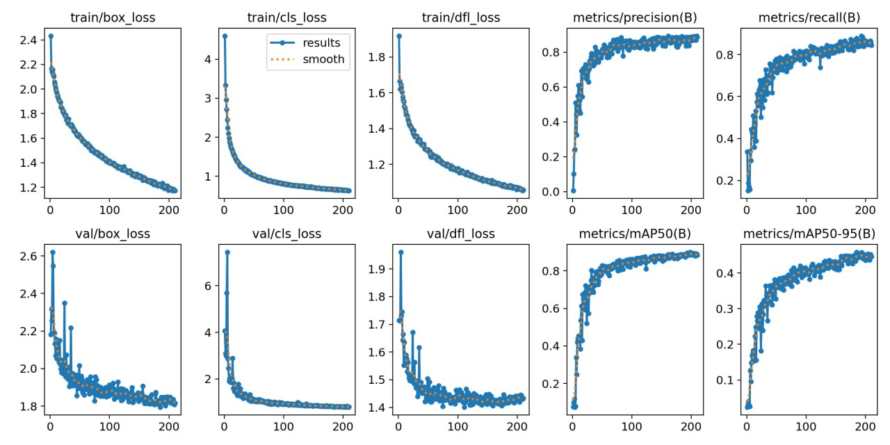

# AtomicHack


# [Ссылка на готовое решение](https://t.me/shmyaks_hack_bot)

### Трек: Определение дефектов сварных швов посредством анализа фотографий швов через обработку изображений с помощью нейросети

## Используемый стек технологий:
- [GO-Backend](https://github.com/ultraevs/AtomicHack/tree/main/go-backend) - Реализован с использванием [GO](https://go.dev/) и фреймворка [Gin](https://github.com/gin-gonic/gin). Задачей модуля является реализация API для взаимодействия с frontend модулем.
- [Frontend](https://github.com/ultraevs/AtomicHack/tree/main/front) - Реализован с использованием [React](https://ru.legacy.reactjs.org/). Задачай является предоставление красивого и функционалоного интерфейса для пользователя.
- [Deployment](https://github.com/ultraevs/AtomicHack/tree/main/deployment) - Реализован с использованием [Docker-Compose](https://www.docker.com/). Задачей модуля является возможность быстрого и безошибочного развертывания приложения на любом сервере.
- [Python-Backend](https://github.com/ultraevs/AtomicHack/tree/main/python-backend) - Реализован с использованием [Python](https://www.python.org/) и фреймворка [FastAPI](https://fastapi.tiangolo.com/). Задачей модуля является возможность распознавания фотографий юзера.
- [Bot](https://github.com/ultraevs/AtomicHack/tree/main/bot) - Реализован с использованием [Python](https://www.python.org/) и фреймворка [Aiogram3](https://docs.aiogram.dev/en/latest/). Задачей модуля является реализация бота для демонстрации решения.


## Функционал решения

- Распознавание деффектов шва по фото.
- Админ панель для сбора статистики о ошибках на предприятии.
- WebApp и классическая текстовая версия для удобства использования.

## Как работает решение

1. API принимает изображение в формате base64, декодирует его и передает в модель.

2. Обработка изображения:

 - Проверка валидности изображения в формате base64.
 - Декодирование изображения из base64 в формат, с которым может работать OpenCV.
   
3. Генерация цветового кода:

 - Если цветовой код для классов не предоставлен, он генерируется автоматически.
 - Создаются уникальные цвета для каждого класса объектов.
   
4. Обнаружение объектов:

 - Использование модели YOLO для обнаружения объектов на изображении.
 - Определение координат обнаруженных объектов и их классов с соответствующими уровнями уверенности.
   
5. Рисование рамок:

 - Создание копий изображения для различных стилей рисования рамок.
 - Отрисовка прямоугольников вокруг обнаруженных объектов с разными стилями и добавление текстовой информации (класс объекта и уровень уверенности).
   
6. Возвращение результатов:

 - Кодирование обработанных изображений обратно в формат base64.
 - Формирование результата в виде словаря, содержащего статус операции, список обнаруженных объектов и изображения с нарисованными рамками.

## Результаты тренировки модели


- **train/box_loss и val/box_loss**: Эти графики показывают потери, связанные с ограничивающими рамками (bounding boxes), на тренировочных и валидационных данных соответственно. Уменьшение значений потерь указывает на улучшение способности модели правильно определять положение объектов.

- **train/cls_loss и val/cls_loss**: Здесь отображены потери классификации на тренировочных и валидационных данных. Снижение этих значений свидетельствует о том, что модель лучше распознает и классифицирует различные объекты.

- **train/dfl_loss и val/dfl_loss**: Эти графики показывают потери распределения (distribution focal loss) на тренировочных и валидационных данных. Уменьшение значений потерь указывает на улучшение точности модели в предсказании распределений объектов.

- **metrics/precision(B) и metrics/recall(B)**: Показывают точность и полноту модели на тренировочных данных. Высокие и стабильные значения указывают на надежность модели в обнаружении и правильной классификации объектов.

- **metrics/mAP50(B) и metrics/mAP50-95(B)**: Эти графики показывают среднюю точность модели (mAP) при пороге IoU=0.5 и среднюю точность при порогах IoU от 0.5 до 0.95. Высокие значения mAP по всем классам подтверждают высокую надежность модели при различных уровнях строгости.

## Запуск решения
```sh
    cd AtomicHack/deployment
    docker-compose build
    docker-compose up -d
```
#### Необходимо создать .env файлы в папке go-backend, python-backend, bot, в которых должны содержаться ваши данные о сервере,базе данных и почтовом аккаунте. Также в вашем nginx и postgresql на сервере нужно указать те же порты что и в коде(местами из .env)
